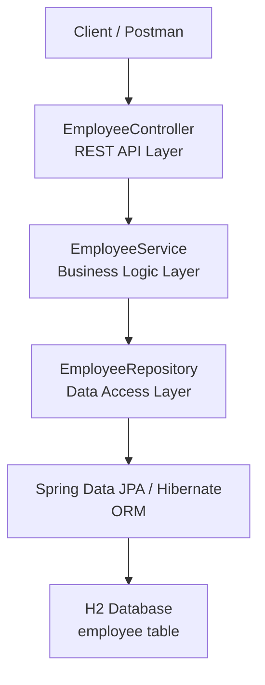
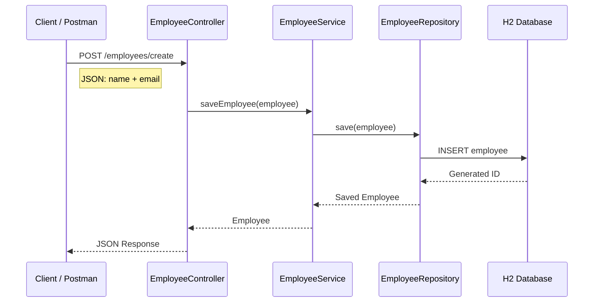
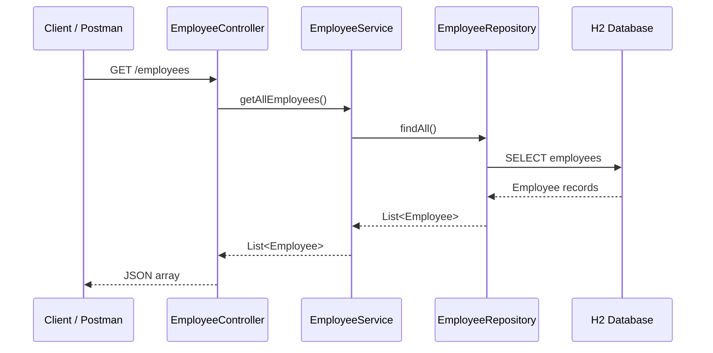
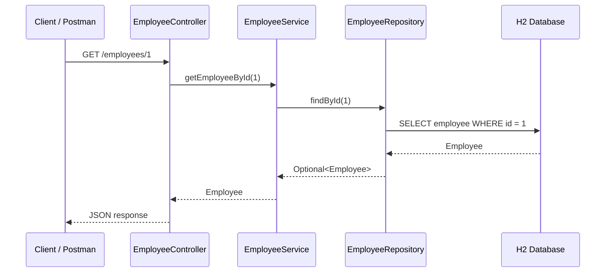
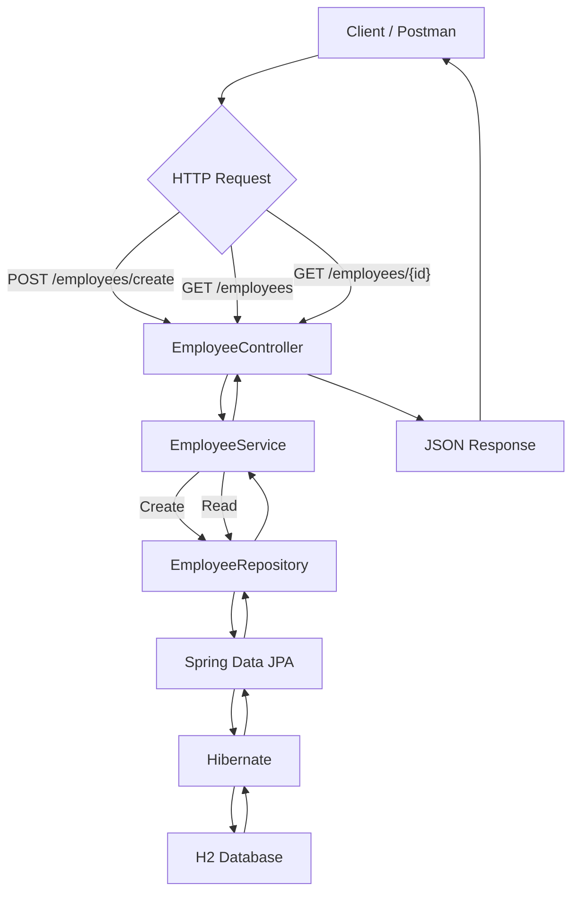
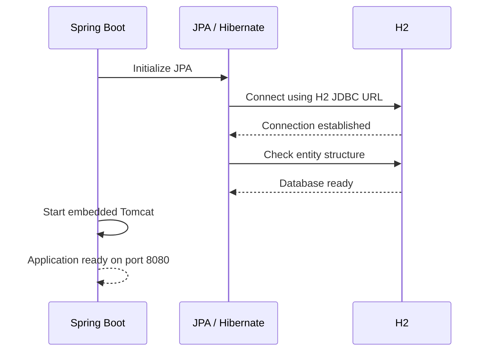

# Employee Management System
# Revise This
A beginner-friendly Spring Boot REST API application for managing employee
information.

> **Current scope:** Create and Read operations only.  
> Update and Delete operations are intentionally not implemented yet.

---

## 1. Project Overview

The Employee Management System is a RESTful web application built using
Spring Boot. It allows a client such as Postman to:

1. Create a new employee.
2. Retrieve all employees.
3. Retrieve a single employee by ID.

The application uses Spring Data JPA and Hibernate to communicate with an
H2 database.

### Technology Stack

| Technology | Purpose |
|---|---|
| Java 17 | Programming language |
| Spring Boot 4.0.1 | Application framework |
| Spring Web | REST API development |
| Spring Data JPA | Database access |
| Hibernate | ORM / database mapping |
| H2 Database | Database |
| Maven | Dependency and build management |
| Postman | API testing |

---

## 2. Application Architecture

The project follows a **layered architecture**.

The main layers are:

- **Controller**
- **Service**
- **Repository**
- **Entity**
- **Database**

### Architecture Diagram



### Simple Explanation

Think of the application like a chain:

```text
Postman
   ↓
Controller
   ↓
Service
   ↓
Repository
   ↓
Database
```

Each layer has a specific responsibility.

---

# 3. Why Do We Use Layers?

A beginner may wonder:

> Why don't we put everything inside the Controller?

We could technically write everything in one class, but that would make the
application difficult to understand, maintain, test, and expand.

Instead, we separate responsibilities.

For example:

- Controller handles HTTP requests.
- Service handles application/business logic.
- Repository communicates with the database.
- Entity represents database data.

This separation is called **Separation of Concerns**.

---

# 4. Project Structure

```text
EmployeeManagement
│
├── src
│   └── main
│       ├── java
│       │   └── com.example.demo
│       │       │
│       │       ├── DemoApplication.java
│       │       │
│       │       ├── controller
│       │       │   └── EmployeeController.java
│       │       │
│       │       ├── entity
│       │       │   └── Employee.java
│       │       │
│       │       ├── repository
│       │       │   └── EmployeeRepository.java
│       │       │
│       │       └── service
│       │           └── EmployeeService.java
│       │
│       └── resources
│           └── application.properties
│
└── pom.xml
```

---

# 5. Entity Layer

## Employee.java

The `Employee` class represents an employee.

```java
package com.example.demo.entity;

import jakarta.persistence.Entity;
import jakarta.persistence.GeneratedValue;
import jakarta.persistence.GenerationType;
import jakarta.persistence.Id;

@Entity
public class Employee {

    @Id
    @GeneratedValue(strategy = GenerationType.IDENTITY)
    private Long id;

    private String name;
    private String email;

    public Long getId() {
        return id;
    }

    public void setId(Long id) {
        this.id = id;
    }

    public String getName() {
        return name;
    }

    public void setName(String name) {
        this.name = name;
    }

    public String getEmail() {
        return email;
    }

    public void setEmail(String email) {
        this.email = email;
    }
}
```

## What does `@Entity` mean?

```java
@Entity
public class Employee
```

`@Entity` tells JPA:

> This Java class represents data that should be stored in a database.

Hibernate uses this class to create and work with the corresponding database
table.

---

## What does `@Id` mean?

```java
@Id
private Long id;
```

`@Id` identifies the primary key of the entity.

In our application:

```text
id
```

uniquely identifies an employee.

For example:

```text
Employee 1 → ID 1
Employee 2 → ID 2
Employee 3 → ID 3
```

---

## What does `@GeneratedValue` mean?

```java
@GeneratedValue(strategy = GenerationType.IDENTITY)
```

This tells the database to automatically generate the employee ID.

Therefore, when creating an employee, **do not send the ID in the request**.

Correct:

```json
{
    "name": "Kiran",
    "email": "kiran@gmail.com"
}
```

The database generates:

```json
{
    "id": 1,
    "name": "Kiran",
    "email": "kiran@gmail.com"
}
```

---

# 6. Repository Layer

## EmployeeRepository.java

```java
package com.example.demo.repository;

import com.example.demo.entity.Employee;
import org.springframework.data.jpa.repository.JpaRepository;

public interface EmployeeRepository extends JpaRepository<Employee, Long> {

}
```

The repository is responsible for communicating with the database through
Spring Data JPA.

## What is `JpaRepository`?

```java
JpaRepository<Employee, Long>
```

The first type is the entity:

```text
Employee
```

The second type is the ID type:

```text
Long
```

Spring Data JPA provides many database operations automatically.

For our current application, we use:

```java
save(employee)
findAll()
findById(id)
```

We don't need to write SQL for these operations.

---

# 7. Service Layer

## EmployeeService.java

```java
package com.example.demo.service;

import com.example.demo.entity.Employee;
import com.example.demo.repository.EmployeeRepository;
import org.springframework.stereotype.Service;

import java.util.List;

@Service
public class EmployeeService {

    private final EmployeeRepository employeeRepository;

    public EmployeeService(EmployeeRepository employeeRepository) {
        this.employeeRepository = employeeRepository;
    }

    // CREATE
    public Employee saveEmployee(Employee employee) {
        return employeeRepository.save(employee);
    }

    // READ ALL
    public List<Employee> getAllEmployees() {
        return employeeRepository.findAll();
    }

    // READ BY ID
    public Employee getEmployeeById(Long id) {
        return employeeRepository.findById(id).orElse(null);
    }
}
```

## What is the Service layer?

The Service layer sits between the Controller and Repository.

```text
Controller
    ↓
Service
    ↓
Repository
```

The Controller should not directly handle database operations.

The Service layer is where business/application logic can be added.

For example, later we might add:

```text
Check whether email already exists
Validate employee information
Apply business rules
```

---

# 8. What Does `@Service` Mean?

```java
@Service
public class EmployeeService
```

`@Service` tells Spring:

> Create and manage an object of this class as a Spring Bean.

Spring can then inject `EmployeeService` into the Controller.

---

# 9. Constructor Dependency Injection

We have:

```java
private final EmployeeService employeeService;

public EmployeeController(EmployeeService employeeService) {
    this.employeeService = employeeService;
}
```

Spring automatically provides the `EmployeeService` object to the Controller.

The same concept is used in the Service:

```java
private final EmployeeRepository employeeRepository;

public EmployeeService(EmployeeRepository employeeRepository) {
    this.employeeRepository = employeeRepository;
}
```

So the dependency chain becomes:

```text
EmployeeController
        ↓
EmployeeService
        ↓
EmployeeRepository
```

---

# 10. Controller Layer

## EmployeeController.java

```java
package com.example.demo.controller;

import com.example.demo.entity.Employee;
import com.example.demo.service.EmployeeService;
import org.springframework.web.bind.annotation.*;

import java.util.List;

@RestController
@RequestMapping("/employees")
public class EmployeeController {

    private final EmployeeService employeeService;

    public EmployeeController(EmployeeService employeeService) {
        this.employeeService = employeeService;
    }

    // CREATE
    @PostMapping("/create")
    public Employee createEmployee(@RequestBody Employee employee) {
        return employeeService.saveEmployee(employee);
    }

    // READ ALL
    @GetMapping
    public List<Employee> getAllEmployees() {
        return employeeService.getAllEmployees();
    }

    // READ BY ID
    @GetMapping("/{id}")
    public Employee getEmployeeById(@PathVariable Long id) {
        return employeeService.getEmployeeById(id);
    }
}
```

---

# 11. Understanding the Controller Annotations

## `@RestController`

```java
@RestController
```

Tells Spring that this class handles REST API requests.

The methods return data such as JSON.

---

## `@RequestMapping`

```java
@RequestMapping("/employees")
```

This defines the common base URL.

Therefore:

```text
/employees
```

is automatically added to the controller's endpoints.

---

## `@PostMapping`

```java
@PostMapping("/create")
```

This handles HTTP POST requests.

The complete endpoint becomes:

```text
POST /employees/create
```

---

## `@GetMapping`

```java
@GetMapping
```

Handles:

```text
GET /employees
```

---

## `@GetMapping("/{id}")`

```java
@GetMapping("/{id}")
```

Handles requests such as:

```text
GET /employees/1
GET /employees/2
GET /employees/10
```

---

## `@RequestBody`

```java
@RequestBody Employee employee
```

Converts the JSON request body into an `Employee` Java object.

For example:

```json
{
    "name": "Kiran",
    "email": "kiran@gmail.com"
}
```

becomes approximately:

```text
Employee
    name  → Kiran
    email → kiran@gmail.com
```

---

## `@PathVariable`

```java
@PathVariable Long id
```

Gets the ID from the URL.

For:

```text
GET /employees/5
```

the value is:

```text
id = 5
```

---

# 12. Database Configuration

The application uses H2 as the database.

`application.properties`:

```properties
spring.datasource.url=jdbc:h2:mem:testdb
spring.datasource.driver-class-name=org.h2.Driver
spring.datasource.username=sa
spring.datasource.password=

spring.jpa.hibernate.ddl-auto=update
spring.jpa.show-sql=true
```

## Explanation

### Database URL

```properties
spring.datasource.url=jdbc:h2:mem:testdb
```

This tells Spring Boot to use an H2 in-memory database named `testdb`.

### Driver

```properties
spring.datasource.driver-class-name=org.h2.Driver
```

Specifies the H2 JDBC driver.

### Username

```properties
spring.datasource.username=sa
```

`sa` is the default H2 user used in this configuration.

### Password

```properties
spring.datasource.password=
```

The password is empty.

### Hibernate DDL

```properties
spring.jpa.hibernate.ddl-auto=update
```

Hibernate uses the entity definition to create/update the database structure.

For example:

```java
@Entity
public class Employee
```

results in an `employee` table being created.

### SQL Logging

```properties
spring.jpa.show-sql=true
```

Shows SQL statements generated by Hibernate in the console.

---

# 13. API Endpoints

The current application has three endpoints.

| Operation | HTTP Method | Endpoint |
|---|---|---|
| Create Employee | POST | `/employees/create` |
| Get All Employees | GET | `/employees` |
| Get Employee By ID | GET | `/employees/{id}` |

---

# 14. Create Employee Flow

## Request

```http
POST http://localhost:8080/employees/create
```

Request body:

```json
{
    "name": "Kiran",
    "email": "kiran@gmail.com"
}
```

## Complete Flow



## Step-by-Step

### Step 1 — Postman sends request

```json
{
    "name": "Kiran",
    "email": "kiran@gmail.com"
}
```

### Step 2 — Controller receives it

```java
@PostMapping("/create")
public Employee createEmployee(@RequestBody Employee employee)
```

Spring converts the JSON into an `Employee` object.

### Step 3 — Controller calls Service

```java
employeeService.saveEmployee(employee);
```

### Step 4 — Service calls Repository

```java
employeeRepository.save(employee);
```

### Step 5 — Repository communicates with H2

Hibernate/JPA generates the database operation.

Conceptually:

```sql
INSERT INTO employee (name, email)
VALUES ('Kiran', 'kiran@gmail.com');
```

### Step 6 — H2 generates the ID

Because the ID is generated automatically:

```text
id = 1
```

### Step 7 — Response returns to Postman

```json
{
    "id": 1,
    "name": "Kiran",
    "email": "kiran@gmail.com"
}
```

---

# 15. Read All Employees Flow

Request:

```http
GET http://localhost:8080/employees
```

### Flow Diagram



The response might be:

```json
[
    {
        "id": 1,
        "name": "Kiran",
        "email": "kiran@gmail.com"
    },
    {
        "id": 2,
        "name": "Raju",
        "email": "raju@gmail.com"
    }
]
```

---

# 16. Read Employee By ID Flow

Request:

```http
GET http://localhost:8080/employees/1
```

### Flow Diagram



Response:

```json
{
    "id": 1,
    "name": "Kiran",
    "email": "kiran@gmail.com"
}
```

---

# 17. Complete Application Flow

The overall flow for both Create and Read operations can be visualized as:



---

# 18. Create vs Read

## Create

```text
POST
   ↓
Controller
   ↓
Service
   ↓
Repository
   ↓
H2
```

Database operation:

```sql
INSERT
```

## Read All

```text
GET
   ↓
Controller
   ↓
Service
   ↓
Repository
   ↓
H2
```

Database operation:

```sql
SELECT
```

## Read By ID

```text
GET /employees/{id}
   ↓
Controller
   ↓
Service
   ↓
Repository
   ↓
H2
```

Database operation:

```sql
SELECT ... WHERE id = ?
```

---

# 19. What Happens When the Application Starts?

When you start the Spring Boot application:



Hibernate detects the `Employee` entity and creates the corresponding table.

Conceptually:

```text
Employee.java
      ↓
@Entity
      ↓
Hibernate
      ↓
employee table
```

---

# 20. Important Beginner Concept: Entity vs Table

A common beginner confusion is:

> Is `Employee` a table or a Java class?

It is a **Java class that is mapped to a database table**.

```text
Java Application                 Database

Employee.java       ────────→    employee
                                    table
```

The fields:

```java
private Long id;
private String name;
private String email;
```

are mapped to columns:

```text
employee
┌────┬────────┬─────────────────┐
│ id │ name   │ email           │
├────┼────────┼─────────────────┤
│ 1  │ Kiran  │ kiran@gmail.com │
└────┴────────┴─────────────────┘
```

---

# 21. Why Do We Need Hibernate?

We could write SQL manually, but Spring Data JPA + Hibernate allows us to
work with Java objects.

Instead of manually writing:

```sql
INSERT INTO employee (name, email)
VALUES ('Kiran', 'kiran@gmail.com');
```

we can write:

```java
employeeRepository.save(employee);
```

Hibernate translates the Java/JPA operation into the appropriate SQL.

This is one of the main benefits of using an ORM.

---

# 22. Why Do We Need a Repository?

The Repository provides the database operations.

Instead of creating JDBC code manually, we use:

```java
employeeRepository.save(employee);
```

```java
employeeRepository.findAll();
```

```java
employeeRepository.findById(id);
```

Spring Data JPA provides the implementation automatically.

---

# 23. Why Do We Need a Service?

The Service layer keeps application logic separate from HTTP handling.

Without a Service:

```text
Controller
   ↓
Database
```

With a Service:

```text
Controller
   ↓
Service
   ↓
Repository
   ↓
Database
```

The second approach is easier to maintain as the application becomes larger.

---

# 24. Why Do We Need a Controller?

The Controller is the entry point for HTTP requests.

For example:

```text
POST /employees/create
```

Spring finds the matching:

```java
@PostMapping("/create")
```

method and executes it.

The Controller then passes the work to the Service.

---

# 25. Current Application Scope

### Implemented

- Create employee
- Get all employees
- Get employee by ID
- Automatic employee ID generation
- H2 database integration
- JPA/Hibernate database mapping
- REST API endpoints
- Layered architecture

### Not Implemented Yet

- Update employee
- Delete employee
- Authentication
- Authorization
- Advanced validation
- Exception handling
- DTO layer
- Global exception handler
- Pagination
- Sorting
- Search/filtering

These can be added later as the application becomes more advanced.

---

# 26. API Summary

### Create Employee

```http
POST /employees/create
```

Request:

```json
{
    "name": "Kiran",
    "email": "kiran@gmail.com"
}
```

Response:

```json
{
    "id": 1,
    "name": "Kiran",
    "email": "kiran@gmail.com"
}
```

---

### Get All Employees

```http
GET /employees
```

Response:

```json
[
    {
        "id": 1,
        "name": "Kiran",
        "email": "kiran@gmail.com"
    }
]
```

---

### Get Employee By ID

```http
GET /employees/1
```

Response:

```json
{
    "id": 1,
    "name": "Kiran",
    "email": "kiran@gmail.com"
}
```

---

# 27. Important Rule When Creating an Employee

Because the ID is automatically generated:

### Correct

```json
{
    "name": "Kiran",
    "email": "kiran@gmail.com"
}
```

### Incorrect

```json
{
    "id": 1,
    "name": "Kiran",
    "email": "kiran@gmail.com"
}
```

The application should allow the database to generate the ID.

---

# 28. Final Architecture Summary

The entire application can be remembered using this simple model:

```text
                 CLIENT
                /      \
              POST      GET
               |         |
               v         v
        ┌─────────────────────┐
        │ EmployeeController  │
        └──────────┬──────────┘
                   ↓
        ┌─────────────────────┐
        │   EmployeeService   │
        └──────────┬──────────┘
                   ↓
        ┌─────────────────────┐
        │ EmployeeRepository   │
        └──────────┬──────────┘
                   ↓
        ┌─────────────────────┐
        │ Spring Data JPA     │
        │ + Hibernate         │
        └──────────┬──────────┘
                   ↓
        ┌─────────────────────┐
        │     H2 Database     │
        │    employee table   │
        └─────────────────────┘
```

## In one sentence

**The client sends an HTTP request to the Controller, the Controller delegates it to the Service, the Service uses the Repository to access the H2 database through JPA/Hibernate, and the result travels back to the client as JSON.**

---

## Learning Path From This Project

Once you understand this application, the natural next steps are:

```text
Current Project
      ↓
Create + Read
      ↓
Update + Delete
      ↓
Exception Handling
      ↓
Validation
      ↓
DTOs
      ↓
Global Exception Handler
      ↓
Pagination & Sorting
      ↓
Search / Filtering
      ↓
Spring Security
      ↓
Authentication + Authorization
```

This gives you a practical path from a **beginner Spring Boot application** toward a more production-style backend.
